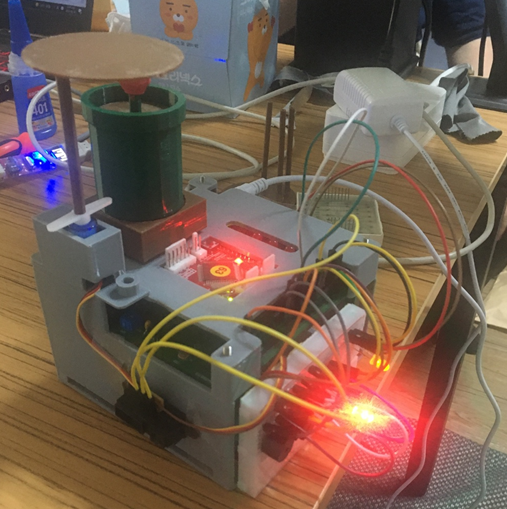

### 7 Sensor Smart Plant with Atmega128

- `Project Goal`

      7개의 센서와 MCU를 사용하여 환경에 맞추어 반응하는 Smart Plant를 제작

 

- `Sensors` 
  
      Ultrasonic, CDS, LM35, Thermistor, PSD, Potentiometer

- `MCU` 

      Atmega128

- `Output Device`  

      Servo Motor, Tri-Color LED, Dot Matrix, Passive & Active Buzzer 

 

- `Function`

      # Timer 0 1 2 
        1. Timer 0 : ISR Control
        2. Timer 1 : Motor PWM
        3. Timer 2 : LED Blink PWM
      
      # PWM / Fast PWM / PC PWM
      # ADC
      # USART
      # IIR Filter (Direct 2 form IIR)
      # Frequency Analysis & Stability Check With MATLAB

 

- `Solid Works를 이용한 HW 설계`

`Solid Works`

`Result`

