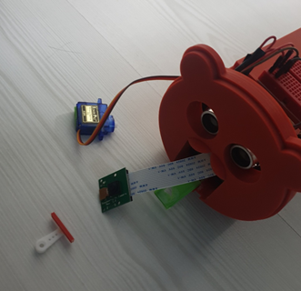

### 고양이 인지 자동 급식기 `July 01 2021 ~ `

- `HW` 

      라즈베리파이 4 4GB
      Pi Camera
      Sonic Sensor
      Servo Motor 
      3D Printer + Solid Works

- `SW`

      OpenCV Cascade Classifier 
      CNN 
      Cron / Daemon 
      Flask / UV4L

 

1. OpenCV + CNN을 이용하여 콩이와 끼끼 구별

       1. Simple CNN
       2. CNN with YOLO
       3. CNN with Cascade Classifier → Select

2. Sonic Sensor를 통해 일정 거리 이상 들어왔을 경우에 카메라 작동 

       → 항시 작동하기에는 라즈베리파이 3B+에 부담이 크다

       → frame 단위로 처리할 것이기에 이 또한 부담이 크다.

       → 특정 frame 수 마다 한 번씩 DNN 모델에 넣어서 처리 

3. 웹 서버에서도 제어할 수 있도록 구성

       → Flask , UV4L 

          - 선택 1 : 제어 Only : Sonic + Servo
          - 선택 2:  제어 + Web or App : Sonic + Servo + Flask + UV4L

4. Reboot 시 초음파 센서와 Flask 웹 서버가 항시 구동 될 수 있도록 하자.

       → Daemon 설정

5. 급식 시간에 맞추어 Sensor와 Pi Camera가 구동할 수 있도록 Timer 설정

       → Cron 설정
