## `Improve BI-Pedal Walker`

- `Project Goal`
    

    Improve BiPedal Walker with Self-Modified RL Algorithms 

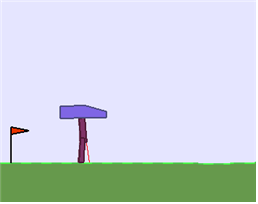

### `개요`

이번 프로젝트는 OpenAI Gym에서 제공하는 Bi-Pedal 예제를 여러 알고리즘을 통해 풀어내고 성능을 향상시키는 것이다.   
사용한 알고리즘은 `DQN, DDPG, TD3, PPO` 이며, `Batch Normalization, Boltzmann Approach(or Soft Voting), Ensemble (Bagging), Noise Decay, Discritization` 등의 기법을 사용해보았다.   
또한 각 알고리즘 및 기법을 비교하고 타당성을 검증하기 위해 CartPole, Pendulum의 예제을 겸하여 과제를 진행하였다.  

먼저 DQN과 D3QN, DDPG는 여러 기법과 하이퍼 파라미터 튜닝에도 성능이 눈에 띄게 좋아지지 않았음을 미리 밝힌다.   
 

---

### `알고리즘 검증 및 고찰`

가장 먼저 접근한 방법은 Bi-Pedal 환경의 4개의 연속 행동 공간을 Discrete하게 만들어 Soft Greedy Policy와 DQN, DDPG 알고리즘을 통해 학습해보는 것이었다. 해당 방법의 타당성을 확인하기 위해 Pendulum 예제를 이용하였다.  

(DDPG + 선형) , (DQN + 비선형)의 두 가지 방법을 이용해보았으며, 비선형 모델은 다음과 같이 Pixel 단위로 Inception 구조를 이용하여 학습하였다.

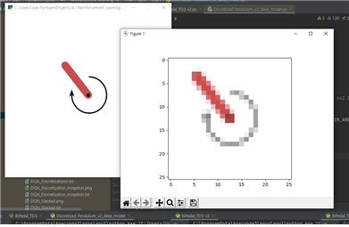

`Pixel 단위 학습`

이 방법은 Pixel의 크기를 최대한으로 줄여 학습하였음에도 학습 속도가 매우 느렸으며 비선형 모델을 사용하기 때문에 수렴성 또한 보장되지 않아 학습마다 결과가 매우 다르게 도출되었다.   
D3QN의 경우에도 Maximization Bias를 제거하며 수렴 속도를 높이는 장점이 있지만, 그럼에도 불구하고 결과적으로 수렴하지 않거나, 비슷한 학습 성능을 보여주었다.

 

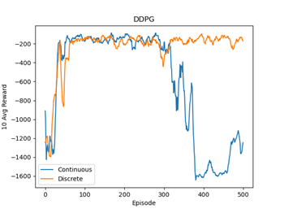

`Pendulum : Continuous Action vs Discrete Action`

선형 모델 + DDPG의 경우 의미 있는 결과를 얻을 수 있었다. 총 5번의 시행 중 3회를 다음과 비슷한 결과 양상을 보여주었으며, 3회 모두 –100 ~ -200 사이로 수렴하였다. 위 결과를 보면 기존의 Continuous한 행동으로 학습을 진행한 것보다 오히려 Discrete하게 변형한 것이 보다 안정적으로 특정 값으로 수렴하는 것을 확인할 수 있다. 

이에 대한 개인적인 견해로, 모델이 어느 정도 수렴이 된 것처럼 보일 때에도 Action이 Continuous한 경우 작은 Noise에도 Gradient 계산이 크게 일어나 학습 안정성이 무너지거나 학습이 올바른 방향으로 나아가지 않는다고 생각한다. 이와 반대로 Discrete한 경우 모델이 일정 부분 수렴한 후, 이산적인 Action의 범위 내에서 일종의 Outliar가 생기지 않아 기존의 수렴성을 그대로 유지하는 경향이 강할 것이리라 추측한다. 즉, Action에 더해지는 Noise는 이산적인 행동의 확률 분포에 영향을 줄 뿐, Action을 수행할 때에는 Noise가 사라지게 된다. 다만 Searching Space가 매우 넓은 예제인 Bi-Pedal의 경우 Action을 이산화하면 학습 데이터가 결과적으로 줄어드는 것이기 때문에 차원의 저주에 따라 학습이 더디게 되거나, 아예 되지 않는 경우가 발생할 것이다. 

결론적으로 이산화된 행동을 통해 Soft greedy Policy를 사용할 수 있었고 Searching Space가 넓지 않은 경우, 보다 안정적으로 수렴하는 결과를 보았으나, 기존의 연속 행동 공간에서 Noise를 추가하는 방식과 수렴 Score 면에서는 크게 차이가 나지 않았다. 따라서 방법론적으로는 의미가 있으나 모델의 Score를 향상시키지는 못하였음을 확인하였고, 각 예제의 Searching Space에 따라 성능이 매우 다를 것임을 예상할 수 있었다. 덧붙여 Pixel 기반 학습 모델은 이미지의 크기에 따라 학습 속도와 수렴 속도가 매우 달라지기 때문에, 보다 복잡한 Bi-Pedal 예제에는 이산화 방법과 비선형 모델(Pixel 단위 학습)은 사용하지 않기로 하였다.

 

다음으로 Continuous Action을 유지하면서, 앙상블 기법을 통해 학습 과정에서의 Variance를 줄이고, 동시에 Exploration을 다른 방법으로 수행할 수 있도록 해보았다. (하단 그림 참고) 

알고리즘은 다음과 같은 흐름으로 수행된다. (모델 6개 사용 시)

1. State를 관찰하고, 이에 대해 Network에서 6개의 Action을 뿌린다.   
2. 6개 Action 각각에 대해 Q Value를 구하고, Softmax 분포 결과를 반환한다.   
3. Boltzmann Policy & Noise Decaying을 수행한다.  
4. DDPG or TD3 알고리즘으로 학습을 수행한다.  
5. 다시 1번으로   

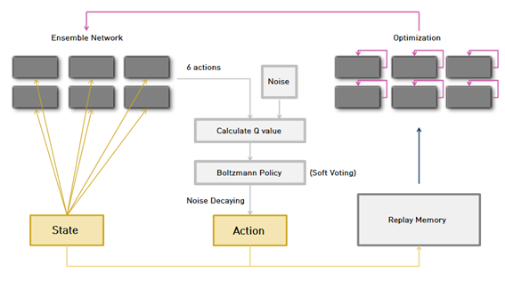

`사용 모델의 구조`

`Step별 부가 설명`

`1번 `: 앙상블 네트워크를 사용한 가장 큰 이유는 학습 Variance를 줄이기 위해서이다. 
즉, 6개의 Batch Sample을 뽑아 학습하고 각 모델의 결과를 Soft Voting을 통해 선택하여 Variance를 줄이는 효과가 있다. 이 Soft Voting이 Boltzmann Policy와 완전히 동일한 역할을 수행한다. 덧붙여 기존 방법보다 더 공격적으로 Exploration을 수행할 수 있고, 효율적인 하이퍼 파라미터 튜닝도 가능하다는 장점이 있다.

최종적으로 학습 알고리즘은 TD3로 선택하였는데, 이 알고리즘을 이용한 학습은 하이퍼 파라미터에 매우 예민하게 반응하고, 앙상블 네트워크의 특성상 학습 속도가 상당히 느리기 때문에 파라미터 튜닝을 보다 효율적으로 할 필요가 있었다. 따라서 Greedy Search 방법을 앙상블을 통해 비슷하게 구현하기로 하였다.

`2번` : Bi-Pedal 예제는 Searching Space가 매우 넓으므로 충분히 다양한 Exploration이 필요하다고 생각하였다. 따라서 1)에서 얻은 6개의 Action에 서로 다른 Noise를 섞어주게 되면 하나의 모델을 사용할 때보다 훨씬 공격적으로 Exploration을 수행할 수 있을 것이다. 
또한 Q-Value의 Softmax 분포에 따라서 Action이 선택될 것이기 때문에, 좋지 않은 Exploration에 대한 Action은 높은 확률로 무시될 것이다. 다시 말해, 더 공격적인 동시에 안정감 있게 Exploration을 수행할 수 있을 것이다. 아래 그래프를 보면, Q Value가 낮은 행동은 매우 적은 확률을 가지므로 높은 확률로 선택되지 않았을 것이다. 

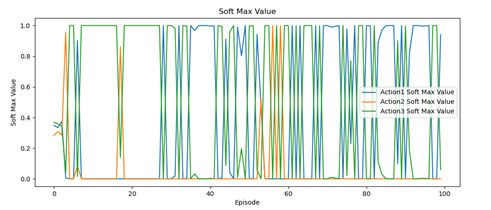

`Softmax Values of 3 Actions with No Noise Decaying`

`3번 `: Noise Decaying를 사용한다. 이를 통해 모델들은 다음 Action을 점점 안정적으로 선택할 수 있을 것이다. 학습 초반에는 큰 Noise를 통해 안정성을 조금 낮추는 대신, Exploration을 더 적극적으로 할 수 있도록 하며, 후반부에는 Noise를 감소시켜 전체적으로 Epsilon Decay와 같은 효과를 낼 것이다. 

Noise Decaying를 사용한 또 하나의 이유는 앙상블 네트워크의 각 모델의 성능과 학습 속도가 모두 다르기 때문에 학습 과정에서 Softmax 분포가 예상보다 빨리 Deterministic하게 변하는 경향이 있기 때문이다. (위 그래프 참조) 따라서 학습 초반부에 큰 Noise를 주어 Softmax 분포가 빠르게 Deterministic하게 변화하지 않도록 해서 Exploration을 일정 시간 유지할 수 있도록 하였다. 학습 후반부에는 매우 높은 확률로 Optimal Action만이 선택될 것이다. 
덧붙여 학습 과정에서 최적의 모델로 선택되지 않은 나머지 모델들은 일종의 지도학습과 같이 최적의 모델이 선택한 Action에 대해서 가중치 학습이 진행될 것이기 때문에, 평균적으로 네트워크의 모델들이 학습 방향을 잘 잡아갈 수 있도록 도와줄 수 있을 것이라 생각한다.

`4번` : 먼저 DDPG + 앙상블 모델로 Bi-Pedal 예제를 학습해보았다. 10번의 시행 중 4회 –20 근처의 Score로 수렴하는 모습을 보였지만, 이보다 더 좋은 Score를 얻어내지 못하는 모습을 보여주었다. DDPG + 싱글 모델로는 대부분 학습이 진행되지 않는 모습을 보였다.

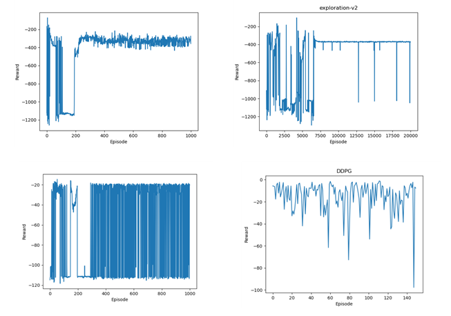

` DDPG Ensemble Bi Pedal, label 표기 모두 동일 범위 `

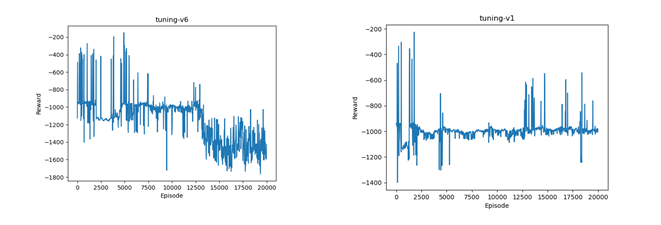

` DDPG Single Bi Pedal, label 표기 모두 동일 범위 `

위의 그래프를 통해 알 수 있었던 것은 앙상블 모델과 단일 모델의 차이점이 수렴하는 빈도 수와 속도도 물론 있지만, 앙상블 모델이 특히나 앞서 언급한 Exploration의 안정성(추측) 덕분에 좋지 않은 행동으로 인해 학습이 무너지는 경우가 훨씬 덜 했다는 것이다. 따라서 앞서 적당한 Searching Space를 가진 예제에서 행동의 이산화를 통해 보다 안정적인 모델을 얻은 것과 비슷한 효과를 얻어낼 수 있었다. 하지만 결론적으로 DDPG 알고리즘으로는 하이퍼 파라미터 튜닝과 여러 기법을 통해서도 Bi Pedal 문제를 해결하지 못하였다. 

 

다음으로 TD3 알고리즘을 사용하였다. 알고리즘 사용의 타당성을 확인하기 위해 Pendulum 예제를 이용하였다. TD3의 싱글 모델와 앙상블 모델 중 앙상블 모델이 총 4회의 학습에서 모두 수렴 속도가 월등히 빨랐음을 확인할 수 있었다. 두 모델 모두 초반 150 Episode 동안 큰 Noise를 견디며 학습이 진행되었으며, 앙상블 모델의 100 Episode 즈음의 큰 하락의 이유가 Soft Voting을 통해 선택된 Noise가 낀 좋지 않은 행동에 의한 것이라 추측된다. 

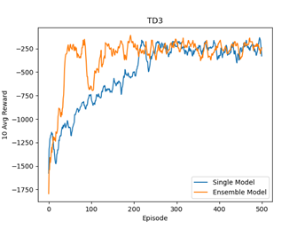

`TD3 Pendulum Single vs Ensemble`

TD3의 경우 싱글 모델을 사용할 때에도, 학습이 쉽게 무너지지 않은 모습을 보여주었다. 
TD3의 학습 결과가 DDPG 보다 안정적인 이유를, 앞서 이야기한 넓은 Searching Space를 Exploration 하는 동안의 Noise에 대한 학습 불안정성에서 찾아보았다. 

이 알고리즘은 Train 과정에서 Q Network와 달리 Actor Network를 간헐적으로 업데이트하기 때문에, 자주 나타나지는 않지만 학습 안정성에 영향이 큰 Noise들에 대해 모델이 더 강건하였을 것이라 추측한다.

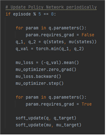

`Update Policy Network per 5 Episode`

 

### `실험 및 결과`

학습에서 사용한 앙상블 네트워크는 총 8개의 모델로 구성하였다.

`1번 모델 : Q Network x 1 || Policy Network x 8 (모두 같은 구조의 모델)`  
`2번 모델 : Q Network x 1 || Policy Network x 8 (모두 다른 구조의 모델)`

총 3회에 걸쳐 4개씩 하이퍼 파라미터를 바꿔가며 학습을 진행하였으며, 학습 시간은 한 번의 학습 당 약 3일(총 9일)이 소요되었다. (1번 모델, 2번 모델 두 개씩 학습)

총 12번의 시행 중 앞선 8번의 학습 결과, 5개의 모델에서 30~60 Episode부터 Reward의 상승 속도가 빠르게 붙기 시작하였고, 100~150 Episode부터 한 번씩 양의 Reward를 내기 시작하였다. 나머지 3개의 모델들은 학습에는 문제가 없으나, 다른 모델들과 같이 학습이 공격적이고 빠르게 일어나지 않았다. 또한 1번 모델이 2번 모델보다 더 단조적으로 학습이 진행되었으며, 결과적으로 수렴 속도, 안정성 면에서 성능이 더욱 좋았다. 
가장 성능이 좋았던 모델은 140~150 Episode에서 학습이 끝났으며, 5개 모두 300 Episode 정도로 학습이 마무리되었다. 

 

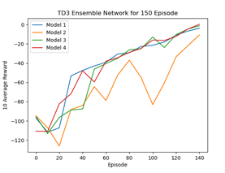

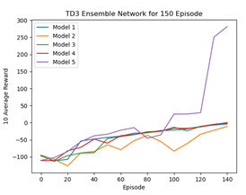

왼쪽 그래프를 통해 평균적으로 모델들이 150 Episode 동안 양의 평균 Reward로 빠르게 올라가는 것을 알 수 있다. 오른쪽 그래프는 학습이 잘 된 모델을 포함한 그래프이다.
위 그래프에서 양의 평균 Reward로 근접하는 것에 초점을 맞춘 이유는, 양의 평균 Reward가 나온 시점으로부터 대부분의 모델들이 50 Episode 내외로 Reward 300을 달성했기 때문이다.  
따라서 마지막 4개의 시행에서는 이 모델들이 얼마나 빠르고 안정적으로 양의 평균 Reward로 접근하는지 확인해보았다. 

덧붙여 학습이 시간적으로 부담이 컸기에, 최종 점수를 계산할 모델을 제외하고서는 모두 300 Episode 언저리에서 학습을 중단하였다. (학습이 충분히 마무리되었다고 판단)

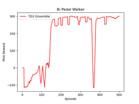

`최종 결과 그래프`

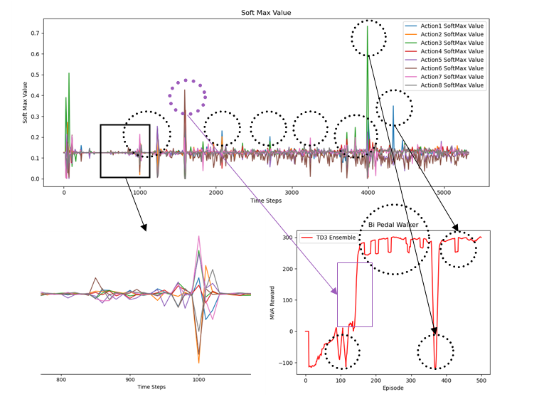

`Softmax Value 분석 그래프`

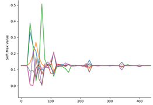

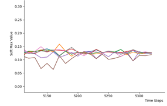

한 가지 더 살펴볼 것은, Softmax 분포를 살펴보면 일정 시간 Uniform한 분포를 유지하다 매우 큰 확률 비중을 차지하는 모델이 등장하거나, 분포가 조금 어지러워지는 경우가 10회 정도 발생하였는데, 이것과 Reward Graph를 같이 살펴보면 매우 흥미롭다.

Reward 그래프에서 Reward가 상승 추세를 유지하다 무너지고 다시 원래의 추세로 돌아오는 포인트들을 살펴보면, Softmax 분포 그래프의 이상치 포인트들과 동일한 포인트로 생각된다. 이 이상치 부분에서의 분포 양상은 완전히 새로운 Noise 또는 새로운 환경에 대한 반응으로 Gradient 계산이 크게 일어나게 된 경우, 이 변화에 대해 가장 잘 반응하는 최적의 Model을 선택하려는 모습이라고 보여진다. 또한 보라색으로 표시한 포인트에서는 학습 과정에서 다른 모델들이 찾지 못한 최적의 행동을 찾아내어 성능을 크게 끌어올리는 모습도 확인할 수 있다. 

덧붙여 최적의 모델로 선택되지 않은 나머지 모델들은 일종의 지도학습과 같이 최적의 모델이 선택한 Action에 대해서 가중치 학습이 진행될 것이기 때문에, 평균적으로 네트워크의 모델들이 학습 방향을 잘 잡아갈 수 있도록 도와줄 것이라 생각한다. 

위의 확대 그래프에서도 볼 수 있듯, 모델의 추세가 무너진 경우에도 기존의 추세를 강하게 회복하는 모습 또한 이에 가장 잘 대응해낸 최적의 행동에 대해서 나머지 모델들의 학습이 진행되기 때문이라고 생각한다.

 

Baseline Model인 DDPG에 대한 수치적 평가 지표 결과는 다음과 같다.

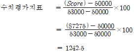

