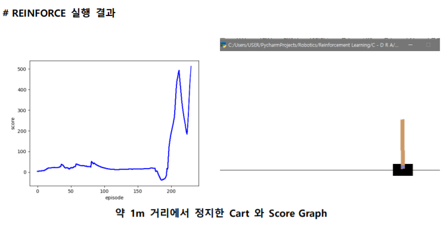
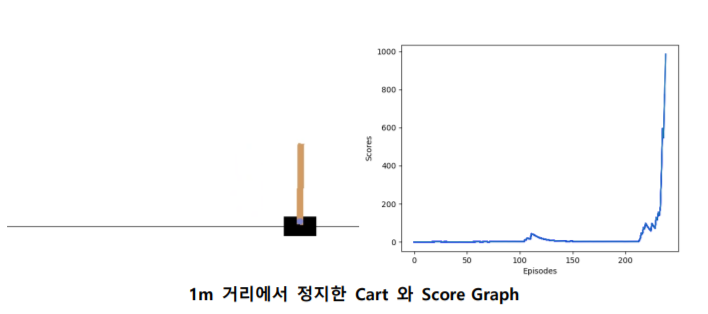
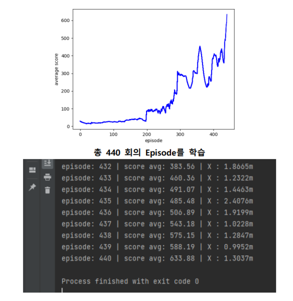

### `Control Cartpole (REINFORCE , DQN , A2C)`

- `Project Goal`

        # 1)
        
        이번 목표는 특정 위치로 이동한 후 그 지점에서 정지하여 Pole을 세우도록 .. !
        (단순히 OpenAI에서 제공하는 CartPole은 Pole을 세워 유지하는 것이 목표)

        # 2)

        friction을 추가  
        
 

- `Project Model`

        1. REINFORCE
        2. A2C
        3. DQN

 

- `Result`

`REINFORCE`

  

`DQN`

`A2C`

