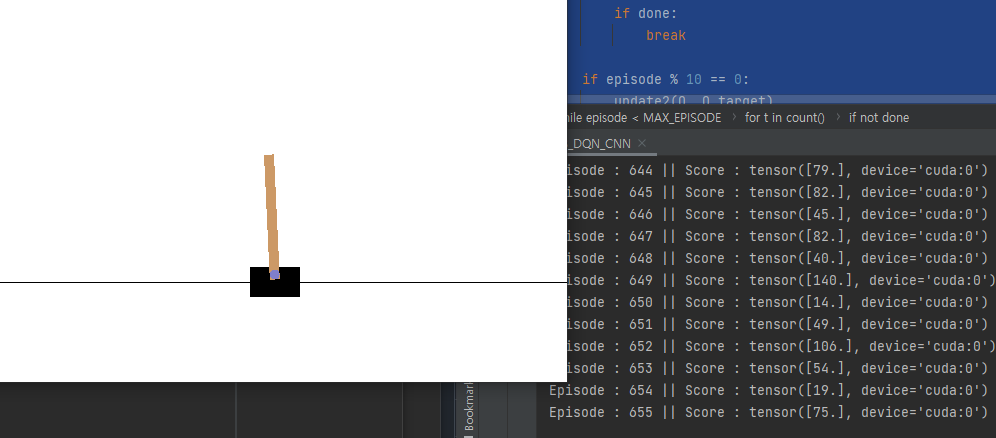

### CartPole with DQN + CNN

- `Project Goal`

        기존의 Linear Neural Network를 통한 CartPole Update에서 

        비선형 모델인 CNN을 통해 CartPole을 Update해본다.

        # Non Linear Model을 사용하면 Converge가 보장되지 않는다.
        따라서 이점을 주의하며 최대한 Converge할 수 있도록 Hyperparameter를 조정해본다.

 

[참고링크](https://tutorials.pytorch.kr/intermediate/reinforcement_q_learning.html)
