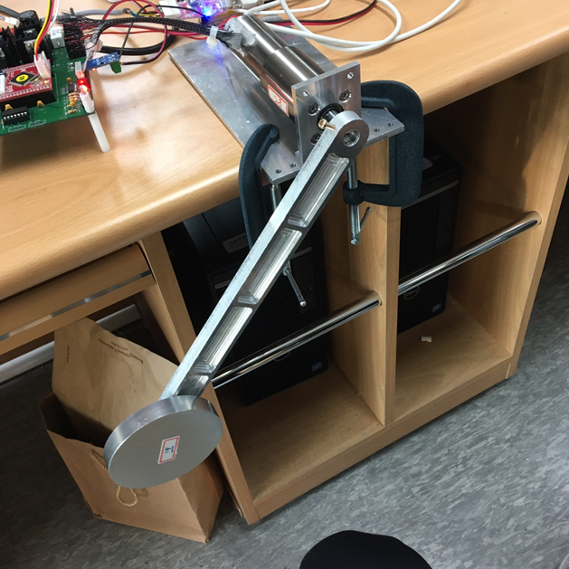
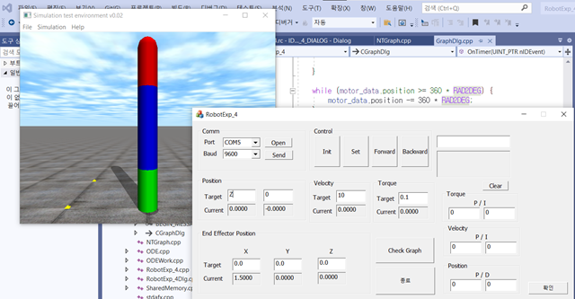
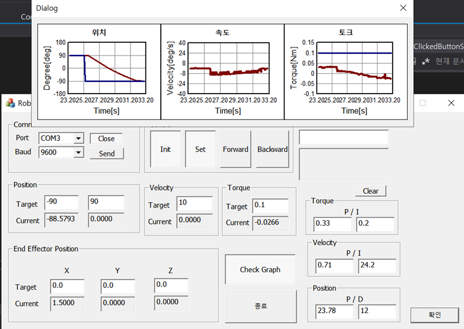

### 2 Link Motor Control

- `Project Goal`

      2 Link Motor Control

 

- `사용 tool`

      Matlab Simulink
      Atmel Studio  
      Visual Studio - ODE

 

`2 Link Arm Motor Control wih Atmega128`  

`MFC / ODE Simulator`

`NTGraph` 

