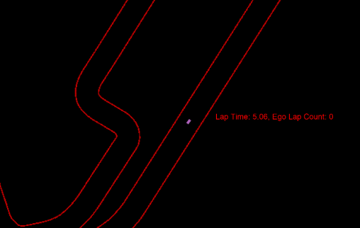
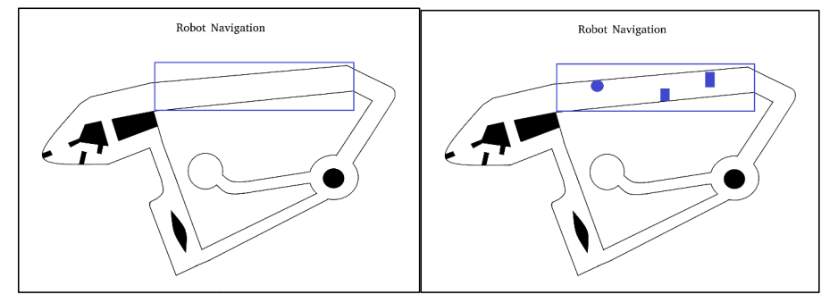
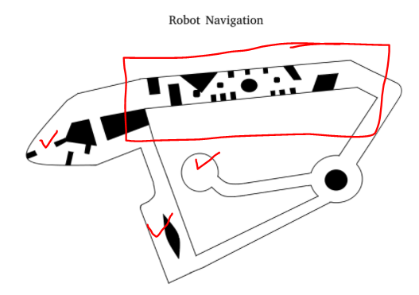
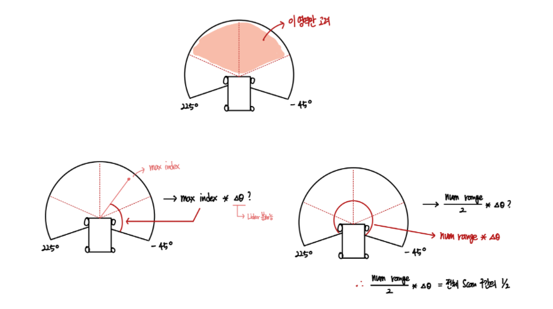

### Robot Navigation project - `F1 TENTH Driving Algorithm`

<div align="center">



</div>

`Took 1st Place in F1TENTH Mid   EXAM !! 🍑`  
`Took 1st Place in F1TENTH Final EXAM !! 🍑🍑`

<div align=center>
   
`MID EXAM`


        

`FINAL EXAM`


</div>        

<br>

- `Project Goal`

1. 다음 지도의 중심 기준 상단 부분은 `Unknown Field` 이다.  
즉, 알려지지 않은 장애물을 피할 수 있는 주행 알고리즘을 짜야한다.


2. 맵 정보가 주어진 경우 체크 포인트를 지나도록 주행 알고리즘을 짜야한다.

<div align="center">

`주어진 맵 정보`



`실제 정답 그림`



</div>

#### Furthest Drive Algorithm 

- Steering Part : `Ackerman Steering 구조 사용`

```python

    class FurtestDrive():
        
        def lidar(self, ranges):
          
          NUM_RANGES = len(ranges)        
          ANGLE_BETWEEN = 2 * np.pi / NUM_RANGES
 
          NUM_PER_QUADRANT = NUM_RANGES // 4
          max_idx = np.argmax(ranges[NUM_PER_QUADRANT:-NUM_PER_QUADRANT]) + NUM_PER_QUADRANT
          
          steering_angle = max_idx * ANGLE_BETWEEN - (NUM_RANGES // 2) * ANGLE_BETWEEN
          speed = 5.0

          return speed, steering_angle 

```    

steering에 대해서 다음 그림을 통해 이해해보자.

<div align="center">



`조향각도 결정`


</div>
