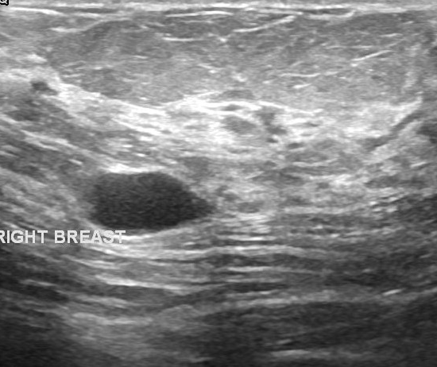
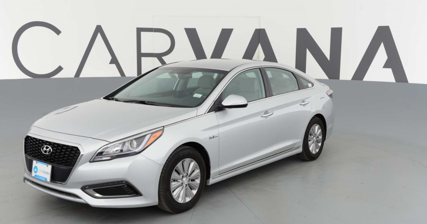
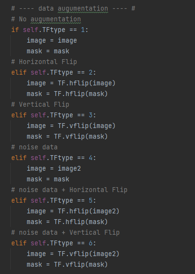

## 프로젝트  

BUSI(Breast Ultra-Sound Image) 데이터셋과 이미지 분할 모델을 이용하여 질병의 유무를 판단   

- 사용 모델

      1. FCN - 구현 
      2. SegNet - 구현
      3. UNET - 구현
      4. DeepLabV3 - pytorch model 이용 

- 사용 데이터 셋 

      1. Human Parsing dataset from Baidu
      2. Carvana Dataset from Kaggle
      3. BUSI Dataset from Kaggle
  
      BUSI 데이터셋 뿐 아니라 두 개의 데이터셋을 더 사용한 이유는 BUSI 데이터셋의 학습이 어려웠기에
      데이터 양이 많고, Feature가 확실한 데이터를 이용해서 모델 성능을 테스트하기 위함이었음.

 

**BUSI Data**

 

**Human Parsing Data**

 

**Carvana Data**

      

---

 

#### 프로젝트 진행 

총 4주 동안 진행하였으며 각 주차별로 진행한 내용은 간략히 다음과 같다.

- 1주차 

      1. 기본 ML, DL 개념 정리 with Pytorch
      2. Segmentation 개념 정리 
      3. Model Code Review 

- 2주차

      1. 논문 리뷰 - FCN, SegNet, UNET, DeconvNet, CAE, ...
      2. Base 모델 정리 - VGG, ResNet, InceptionNet ...
      3. 평가 지표 정리
      4. FCN 구현 
      5. 데이터 전처리 

- 3주차 

      1. SegNet, UNET 구현 및 튜닝, 성능 비교 
      2. 데이터 증폭 
      3. 모델 정리 (Tensorboard, tqdm, color map, ..)
      4. DeepLab V2 개념  
                  - dilated Convolution
                  - Naive Bayes
                  - Hidden Markov Model ~ing
                  - CRF ~ing

---

 

#### 데이터 전처리

1. Data Resizing

         torchvision.datasets.ImageFolder 이용
         DataLoader의 init 함수에서 처리

2. Data augumentation

          torchvision.transforms.functional 이용
      
          1. noise x
              normal img
              horizontal flip
              vertical flip
              # horizontal flip + vertical flip -- 선택
  
          2. noise o
              normal img
              horizontal flip
              vertical flip
              # horizontal flip + vertical flip -- 선택

          720개 -> 6480개로 증폭 (+ 1440개)

---

 

#### train ACC, Loss

                 
**UNET**
           

      
           
           

           

#### 구현 결과

**FCN**

 

**SegNet**

 

**UNET - Carvana**

 

**UNET - BUSI**

      

            

      
상대적으로 작은 객체에 대해서는 제대로 분할을 못하는 모습을 보여준다.      

      
           

---

 

#### 고찰 및 정리 

- FCN 

       FCN은 Upsampling을 이용해 해상도를 복원시키는 과정을 거치는 모델이다.
    
       하지만 데이터가 매우 뭉텅이 진 상태로 분할된 결과를 보여준다. 
    
       이것을 Skip connection 기법을 사용해서 어느 정도 dense하게 픽셀 분류를 가능하게 해준다.
    
       결과를 보면 feature의 위치는 어느 정도 찾아주는 모습을 보이나 경계가 뚜렷하지 않는 단점이 있다.

- SegNet 

       SegNet도 FCN과 마찬가지로 Upsampling 과정이 존재한다.
    
       다만 차이점은 FCN은 Conv에 의해 작아진 이미지를 복원시키고, SegNet은 Pooling에 의해 작아진 부분을 복원시킨다. 
    
       Pool 과정에서 해당 index를 기억해두고, Unpooling할 때 이 위치에 해당 값을 복원시키는 원리로 진행된다.
    
       이렇게 되면 Unpooling된 결과가 매우 Sparse하게 되는데, 이 결과에 1x1 Conv를 수행하며 Dense하게 만들어준다.
    
       SegNet의 특징은 위와 같이 Unpooling을 수행하기 때문에 객체의 경계를 뚜렷히 잡아주고, 또 객체의 위치도 잘 잡아낸다.
    
       직접 구현한 모델은 학습량, 데이터량, 그리고 전이 학습을 진행하지 않았음에도 객체의 경계를 상당히 잘 잡아주는 것을 알 수 있다.

- UNET

       UNET은 FCN과 동일하게 Conv에 의해 작아진 부분을 Upsampling한다.
    
       또한 SegNet에서와 같이 1x1 Conv를 통해 feature를 dense하게 만든다.
    
       추가적으로 FCN의 Skip Connection도 사용한다. 
    
       FCN, SegNet, 그리고 DeconvNet의 특징을 모두 모아서 만든 모델이라고 생각된다.

            * DeconvNet의 특징 : Bottle Neck layer            
    
       결과를 보면 FCN, SegNet의 특징을 모두 갖고 있는 것이 확인가능하다.
    
            하지만 구현한 모델은 큰 객체는 비교적 잘 잡아내는 반면 작은 객체는 잘 잡아내지 못하는 결과를 보여주었다.
    
            Carvana 데이터셋을 이용한 경우에는 매우 잘 잡아냈던 걸 보면, 아마 BUSI 데이터셋을 더 세밀하게 처리하면 좋은 결과를 얻을 수 있을 것 같다. 

 

