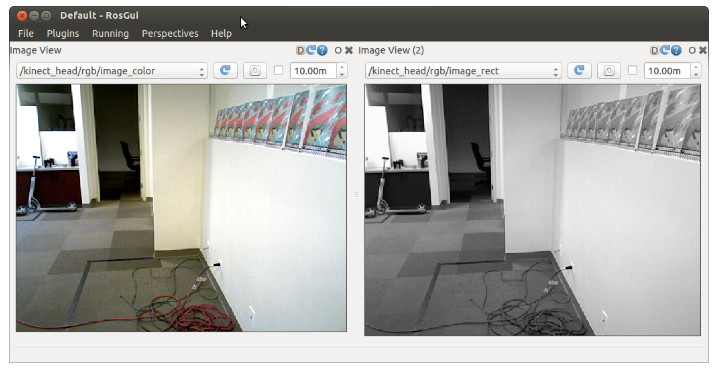
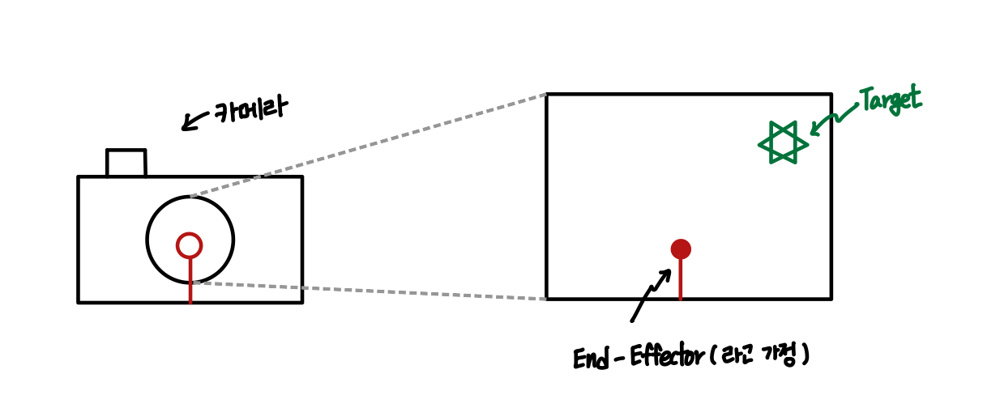
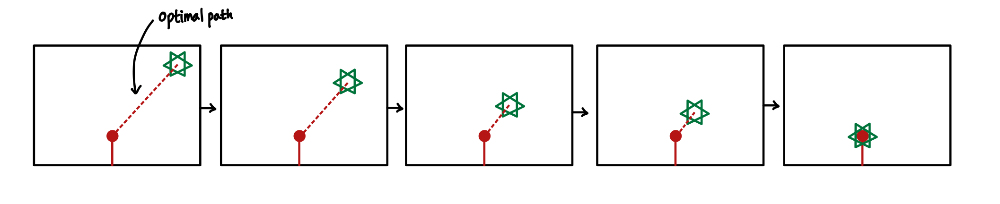
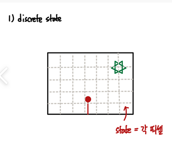
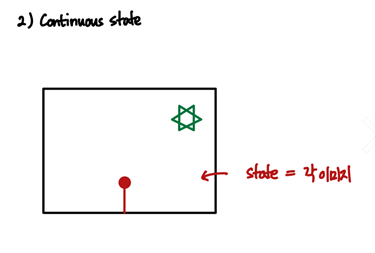

### ROS & RL base Path Finder  

- `Dataset` 

        ROS rqt base Camera Image

- `ROS`

        rqt tool     

- `Model`

        # Object Detection 
            1. RCNN Base
            2. YOLO Base

        # PG Base Algorithm
            1. REINFORCE
            2. A2C
            3. DPG
            4. DDPG

- `HW`

        Arduino or Rbpi 3 or 4
        DC Motor x 2
        Camera x 1

 

- `Project - 이미지 내 물체까지의 최적 경로 학습` 

    

카메라 정면에 End Effector 모형을 부착하는 것으로 목표 지점 정의

1. 이미지 내 객체 탐지 
2. 카메라를 움직이며 해당 물체와 End Effector가 만나도록 학습

 

- `학습 환경 - state / action` 

1. Discrete State Base

        이미지를 N x N 픽셀로 나누고, EE에서 각 픽셀까지의 Optimal Path를 학습 

2. Continuous States Base

          물체가 있는 이미지 하나를 State로 판단하고, 연속적인 State에 대한 Optimal Policy를 학습

3. Discrete Action

          Discrete State Base   - 상하좌우 이동 거리 적당히
          Continuous State Base - 상하좌우 이동 거리 정밀하게 

  

        
