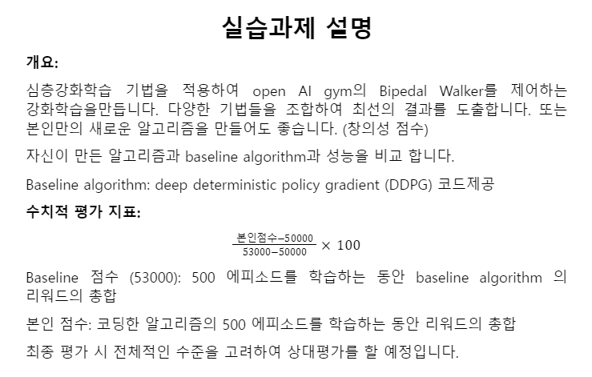
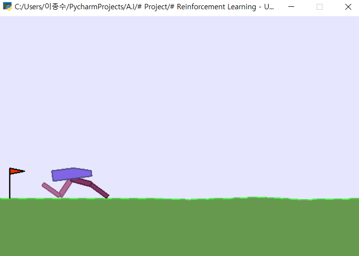

### Upgrade Pi-Pedel Simulation - LAB Task  

- `Project Goal`
  
       OpenAI에서 제공하는 Bi-Pedal Simulation은 DDPG를 기반으로 실행된다.

       이 Simulation을 향상시켜보자.

- `Project Key Point`

        기존 DDPG 알고리즘의 한계를 명확히 규명하고, 

        이를 수학적 근거를 기반으로 향상시켜 Lab Seminar에서 발표할 수 있도록 할 예정

 

 

